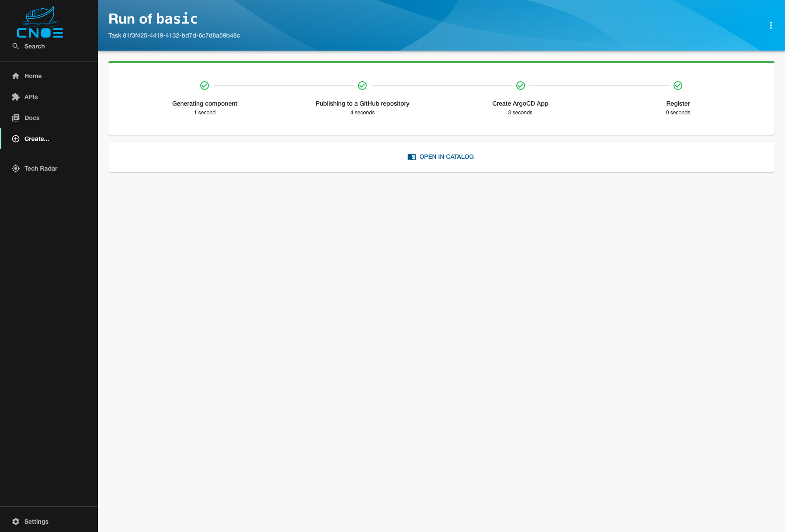
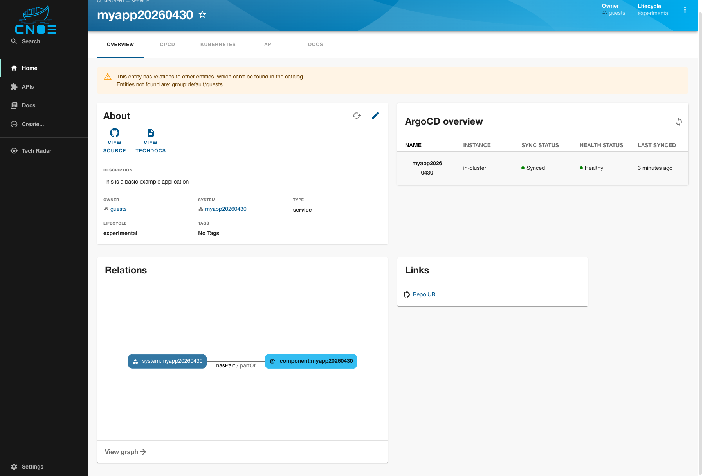
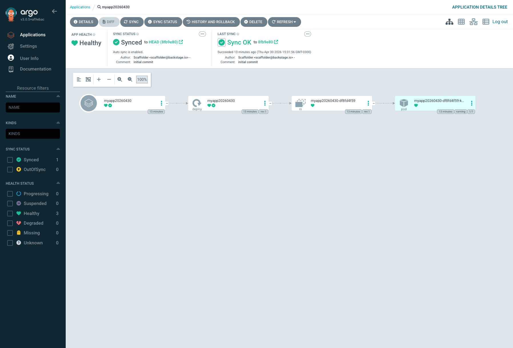
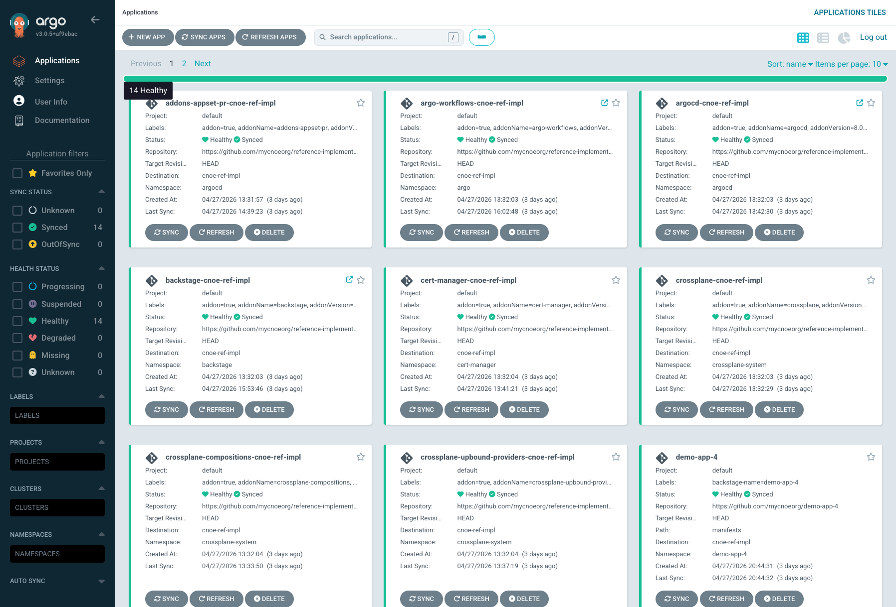

# Roteiro de Demonstração — Plataforma CNOE (CGU)

**Apresentador:** Pablo Silva (AWS ProServe)  
**Audiência:** CGU — stakeholders técnicos e gestores  
**Duração estimada:** 45–60 minutos  
**Ambiente:** EKS `cnoe-ref-impl`, `us-west-1`, conta `025775160945`, perfil `hubcnoe`  
**Acesso:** via `/etc/hosts` + port-forward local (DNS público removido por compliance DyePack/Midway)  
**URL base:** https://pcsilva.people.aws.dev (resolvida localmente via `/etc/hosts`)  
**Documento base:** `anexo-cgu-crossplane-kro.md`

---

## 0. Objetivo

Demonstrar, com tudo rodando ao vivo, como a plataforma materializa cada recomendação técnica do anexo da CGU:

1. Autoatendimento para técnicos (GitOps) e não técnicos (Backstage forms)
2. Reconciliação contínua e detecção de desvio
3. Day-2 operations via `managementPolicies` + `crossplane.io/paused`
4. Composição heterogênea (Crossplane + KRO + Terraform na mesma plataforma)
5. Gestão de segredos fora do Git via External Secrets Operator
6. Reuso de módulos Terraform legados sem reescrita

Todas as demos foram validadas contra o cluster real. As tecnologias do anexo estão **todas instaladas** e são demonstráveis ao vivo.

---

## 1. Mapa tecnologia × seção do anexo × demo

| Tecnologia | Seção anexo | Instalação | Demo |
|---|---|---|---|
| Crossplane v1.20 + provider-upjet-aws | §3, §4, §10.1 | ✅ | Demo 3 |
| Crossplane Compositions + XRD | §3, §5 | ✅ | Demo 3 |
| `managementPolicies` (Observe/Create/Update/Delete) | §7.1 | ✅ | Demo 4 |
| `crossplane.io/paused` | §7.1, §10.2 | ✅ | Demo 4 |
| `EnvironmentConfig` | §8.1, §10.2 | ✅ | Demo 3 (referência) |
| **KRO v0.9.1** (ResourceGraphDefinition) | §10.1 bullet 2 | ✅ | **Demo 6** |
| **provider-terraform v0.17** (Workspace) | §5, §10.1 bullet 3 | ✅ | **Demo 7** |
| **Composição heterogênea** (AWS + GCP via Composition) | §6 | ✅ | **Demo 8** |
| External Secrets Operator + AWS Secrets Manager | §8 | ✅ | Demo 5 |
| Backstage (Scaffolder + Catalog) | §9 | ✅ | Demo 1 |
| Argo CD (GitOps + SSO Keycloak) | §3, §10.4 | ✅ | Demo 2 |
| Keycloak (SSO OIDC) | §9 | ✅ | Demo 1, 2 |

---

## 2. Checklist pré-demo (10 minutos antes)

### 2.1 Setup de acesso local (uma vez por máquina)

O DNS público `pcsilva.people.aws.dev` foi removido por compliance (DyePack detectou ausência de Midway SSO). O acesso agora é via port-forward + `/etc/hosts`.

```bash
# Adicionar entry no /etc/hosts (uma vez só)
grep -q "pcsilva.people.aws.dev" /etc/hosts || \
  sudo bash -c 'echo "127.0.0.1  pcsilva.people.aws.dev" >> /etc/hosts'

# Iniciar port-forwards em background (cobre Backstage, ArgoCD, Keycloak, Argo Workflows)
./scripts/start-port-forwards.sh

# Para parar os port-forwards ao final da demo:
# ./scripts/stop-port-forwards.sh
```

### 2.2 Validação do cluster

Execute o bloco abaixo e confirme que tudo retorna verde:

```bash
export AWS_PROFILE=hubcnoe
export AWS_REGION=us-west-1

# 1. Cluster e nodes
kubectl --context=cnoe-ref-impl get nodes

# 2. Addons plataforma: todos Healthy
kubectl --context=cnoe-ref-impl get application -n argocd --no-headers | grep -v Healthy && echo "PROBLEMA" || echo "✓ todos Healthy"

# 3. Providers Crossplane + KRO + provider-terraform
kubectl --context=cnoe-ref-impl get provider.pkg.crossplane.io
kubectl --context=cnoe-ref-impl -n kro-system get deploy kro
kubectl --context=cnoe-ref-impl get clustersecretstore
kubectl --context=cnoe-ref-impl get providerconfig.tf.upbound.io

# 4. Endpoints via port-forward local (requer start-port-forwards.sh ativo)
for p in "" "/argocd" "/argo-workflows" "/keycloak/realms/cnoe/.well-known/openid-configuration"; do
  printf "%-55s " "https://pcsilva.people.aws.dev$p"
  curl -sk -o /dev/null -w "HTTP %{http_code}\n" -L --max-time 10 "https://pcsilva.people.aws.dev$p"
done
```

**Credenciais:**

Os valores reais das credenciais estão em `.env` (não commitado). Carregar no shell com:

```bash
set -a; source .env; set +a
```

- Backstage / ArgoCD / Argo Workflows via SSO: **`$DEMO_SSO_USER`** / **`$DEMO_SSO_PASSWORD`**
- ArgoCD admin fallback: **`admin`** / **`$ARGOCD_ADMIN_PASSWORD`**
- Keycloak admin console (`/keycloak/admin/`): **`$KEYCLOAK_ADMIN_USER`** / **`$KEYCLOAK_ADMIN_PASSWORD`**

> Padrão: nenhuma credencial em plaintext no Git. Ver `.env.example` para o formato esperado.

Todos os artefatos de demo estão em **`~/cnoe-ref-impl/demo-artifacts/`** (veja `README.md` lá dentro).

---

## 3. Abertura (5 min) — a narrativa

Sem console, sem terminal. Fale apenas com as tabelas do anexo:

1. **Contexto (§2):** dois perfis de usuário, requisitos de Day-2, multicloud, acervo Terraform existente
2. **Por que não só Terraform (§3):** reconciliação contínua vs `plan`/`apply`, detecção automática de desvio, estado nativo no etcd, RBAC granular, APIs de domínio
3. **Por que não só Crossplane:** janela de features (§4.1), acervo Terraform (§5) → a plataforma **combina** os dois

**Ponte:** *"Vamos ver exatamente esse combinado rodando. Começo pelo caminho do usuário não técnico, depois mostro o caminho do SRE, depois a mecânica por baixo."*

---

## 4. Demo 1 — Backstage: autoatendimento para não técnicos (7 min)

**Anexo §9 — "Interface para usuários não técnicos"**

### Roteiro

1. Abrir https://pcsilva.people.aws.dev
2. **LOG IN VIA KEYCLOAK** → `user1` / senha
3. Sidebar → **Create…** → **Create a Basic Deployment** → **CHOOSE**
4. Preencher `name: cgu-demo-app` → **REVIEW** → **CREATE**
5. Acompanhar os 4 steps: Generate → Publish to GitHub → Create ArgoCD App → Register

### Narrar enquanto roda

> *"O usuário não viu Git, YAML ou AWS. Nos bastidores o Backstage: criou um repositório novo via GitHub App, commitou manifests renderizados do template, criou um Argo CD Application apontando para o repo e registrou no catálogo. Padrão do §9: plataforma expõe schemas (XRDs/RGDs), interface consome o schema."*

### Validação nos bastidores

```bash
gh api /repos/mycnoeorg/cgu-demo-app --jq '{full_name, created_at, default_branch}'
gh api /repos/mycnoeorg/cgu-demo-app/contents/manifests --jq '.[].name'
kubectl get application -n argocd cgu-demo-app
kubectl -n default get deploy cgu-demo-app
kubectl -n default get pods -l app=nginx
```

Abrir **Argo CD UI** (https://pcsilva.people.aws.dev/argocd) → app `cgu-demo-app` Synced/Healthy, topology view.

### Resultado esperado

**Backstage Scaffolder — 4 steps concluídos com sucesso:**



**Componente registrado no catálogo com ArgoCD Synced/Healthy:**



**ArgoCD — topology view do app criado (App → Deployment → ReplicaSet → Pod):**



---

## 5. Demo 2 — Reconciliação contínua + detecção de desvio (5 min)

**Anexo §3, §10.4**

```bash
# Estado atual
kubectl -n default get deploy cgu-demo-app -o jsonpath='{.spec.replicas}{"\n"}'

# Operador "rebelde" mexe fora do GitOps
kubectl -n default scale deploy/cgu-demo-app --replicas=5
kubectl -n default get deploy cgu-demo-app

# ArgoCD vai detectar drift. Na UI: app fica OutOfSync.
# Forçar Sync (ou esperar o auto-sync da Application padrão)
kubectl -n argocd patch application cgu-demo-app --type=merge \
  --patch='{"operation":{"sync":{"prune":true,"syncStrategy":{"apply":{"force":true}}}}}'
sleep 8

# Voltou pro estado declarado
kubectl -n default get deploy cgu-demo-app
```

**Mensagem:** *"No Terraform clássico o desvio só aparece quando alguém roda `plan`. Aqui é contínuo e exposto como métrica Prometheus — a CGU pode construir SLO de drift detection."*

### Resultado esperado

**ArgoCD — todos os 14 addons Healthy/Synced:**



Mostrar métricas:

```bash
kubectl -n crossplane-system exec deploy/crossplane -- \
  wget -qO- http://localhost:8080/metrics 2>/dev/null | grep -E 'managed_resource|drift_seconds' | head -5
```

---

## 6. Demo 3 — Crossplane: provisionando AWS via Claim (10 min)

**Anexo §3 (abstração), §10.1, §10.2**

### 6.1 Ver a abstração que existe

```bash
# O schema exposto ao consumidor final
kubectl get xrd xobjectstorages.awsblueprints.io

# A composição real (S3 + PublicAccessBlock + ServerSideEncryption)
kubectl get composition s3bucket.awsblueprints.io \
  -o jsonpath='{.spec.resources[*].base.kind}{"\n"}'

# Providers nativos disponíveis
kubectl get provider.pkg.crossplane.io
```

### 6.2 Aplicar EnvironmentConfig (defaults da plataforma)

```bash
kubectl apply -f ~/cnoe-ref-impl/demo-artifacts/01-environment-config.yaml
kubectl get environmentconfig cgu-platform-defaults -o yaml | head -20
```

> *"Isso é o §8.1 do anexo: valores estáticos da plataforma (tags, região) em uma fonte única. Qualquer Composition pode referenciar."*

### 6.3 Criar 1 Claim → 3 recursos AWS

```bash
kubectl apply -f ~/cnoe-ref-impl/demo-artifacts/02-cgu-bucket-claim.yaml

# Aguardar ~15s e inspecionar
sleep 15
kubectl get objectstorage,xobjectstorage -A
kubectl get bucket,bucketpublicaccessblock,bucketserversideencryptionconfiguration -A

# Nome real do bucket na AWS
BUCKET=$(kubectl get bucket -l crossplane.io/claim-name=cgu-demo-bucket \
  -o jsonpath='{.items[0].metadata.annotations.crossplane\.io/external-name}')
echo "bucket AWS: $BUCKET"

# Confirmar no AWS
aws s3api head-bucket --bucket "$BUCKET" --region us-west-1 --profile hubcnoe
aws s3api get-bucket-encryption --bucket "$BUCKET" --region us-west-1 --profile hubcnoe
aws s3api get-bucket-tagging --bucket "$BUCKET" --region us-west-1 --profile hubcnoe
```

**Mensagem:** *"Um Claim → três recursos AWS reconciliados continuamente. O consumidor só pediu `ObjectStorage`; a Composition cuidou de encryption, public access block e tags obrigatórias. Esse é o padrão do §3 do anexo."*

---

## 7. Demo 4 — Day-2: `managementPolicies` + `paused` (7 min)

**Anexo §7.1 — requisito central da CGU (gerenciar sem poder destruir)**

### 7.1 Adotar bucket legado em modo Observe

```bash
# 1) Criar bucket "legado" fora do Crossplane (simula algo que já existe)
BUCKET_NAME="cgu-legacy-$(date +%s)"
aws s3api create-bucket --bucket "$BUCKET_NAME" --region us-west-1 \
  --create-bucket-configuration LocationConstraint=us-west-1 --profile hubcnoe
echo "$BUCKET_NAME" > /tmp/cgu-legacy.txt

# 2) Substituir o placeholder no manifesto
sed -e "s/BUCKET_NAME_PLACEHOLDER/${BUCKET_NAME}/" \
  ~/cnoe-ref-impl/demo-artifacts/06-observe-only.template.yaml \
  > /tmp/06-observe-only.yaml

# 3) Adotar em modo Observe
kubectl apply -f /tmp/06-observe-only.yaml
sleep 10

# 4) Verificar policy e leitura (nunca escreve)
kubectl get bucket cgu-legacy-adopted -o yaml | yq '.spec.managementPolicies, .status'
```

### 7.2 Provar a restrição: deletar MR não toca o recurso real

```bash
# Deletar o Managed Resource
kubectl delete bucket cgu-legacy-adopted

# Bucket real continua lá
aws s3api head-bucket --bucket "$(cat /tmp/cgu-legacy.txt)" --region us-west-1 --profile hubcnoe && \
  echo "✅ bucket AWS preservado — managementPolicies protegeu o recurso"
```

**Mensagem:** *"Esse é o requisito central do §7.1: 'capacidade de gerenciar sem poder alterar ou destruir'. A policy `[Observe]` é RBAC declarativo sobre o ciclo de vida."*

### 7.3 Janela de manutenção com `crossplane.io/paused`

```bash
MR=$(kubectl get bucket -l crossplane.io/claim-name=cgu-demo-bucket -o jsonpath='{.items[0].metadata.name}')

# Pausar reconciliação
kubectl annotate bucket "$MR" crossplane.io/paused=true --overwrite
sleep 3
kubectl get bucket "$MR" -o jsonpath='{range .status.conditions[*]}{.type}={.status} {end}{"\n"}'
# Esperado: Synced=False enquanto pausado

# Retomar
kubectl annotate bucket "$MR" crossplane.io/paused- --overwrite
sleep 5
kubectl get bucket "$MR" -o jsonpath='{range .status.conditions[*]}{.type}={.status} {end}{"\n"}'
# Esperado: Synced=True
```

**Mensagem:** *"§10.2 bullet 4: 'Auditoria via `crossplane.io/paused` para janelas de manutenção, nunca via desabilitação do provider'. Reversível, granular por recurso."*

### 7.4 Matriz de políticas (ler §7.1 do anexo)

| Policy | Uso |
|---|---|
| `["Observe"]` | Recurso legado — **caso CGU** |
| `["Observe","Create","Update","LateInitialize"]` | Adoção sem risco de deleção |
| `["Observe","Create","Delete"]` | Imutabilidade pós-criação |
| `crossplane.io/paused` | Janela de manutenção reversível |

---

## 8. Demo 5 — Segredos via ESO, fora do Git (5 min)

**Anexo §8.1 e §8.2 (anti-padrão)**

### 8.1 A plataforma já consome segredos corretamente

```bash
# O ClusterSecretStore que conecta o cluster ao AWS Secrets Manager
kubectl get clustersecretstore aws-secretsmanager -o yaml | yq '.spec.provider.aws'

# Todos os ExternalSecrets da plataforma
kubectl get externalsecret -A

# Exemplo real: credenciais da GitHub App do Backstage
kubectl get externalsecret -n argocd github-app-org -o yaml | yq '.spec'

# O secret Kubernetes resultante (mostra só as chaves, não os valores)
kubectl get secret -n argocd github-app-org -o jsonpath='{.data}' | jq 'keys'
```

### 8.2 Anti-padrão do §8.2 (mostrar como slide)

```yaml
# ❌ ERRADO: senha no Git
apiVersion: ssm.aws.upbound.io/v1beta1
kind: Parameter
spec:
  forProvider:
    type: SecureString
    value: "senha-em-claro"     # ← vai pro etcd, pode ir pro Git
```

```yaml
# ✅ CERTO: segredo só na AWS Secrets Manager, referência no manifesto
apiVersion: external-secrets.io/v1
kind: ExternalSecret
spec:
  secretStoreRef:
    name: aws-secretsmanager
    kind: ClusterSecretStore
  target:
    name: app-secrets
  data:
    - secretKey: db-password
      remoteRef:
        key: prod/myapp/db-password
```

**Mensagem:** *"Fluxo do anexo §8: AWS Secrets Manager → ESO → Secret Kubernetes → Composition. Nunca o caminho inverso."*

---

## 9. Demo 6 — KRO: abstração simples sem Composition Functions (7 min)

**Anexo §10.1 bullet 2 — "KRO quando abstração for centrada em objetos nativos"**

### 9.1 KRO já está instalado

```bash
kubectl -n kro-system get pods
kubectl get crd | grep kro
```

### 9.2 Registrar um ResourceGraphDefinition

```bash
# Ver o RGD
cat ~/cnoe-ref-impl/demo-artifacts/03-kro-webapp-rgd.yaml

# Aplicar
kubectl apply -f ~/cnoe-ref-impl/demo-artifacts/03-kro-webapp-rgd.yaml
sleep 5

# KRO gera um CRD novo a partir do RGD
kubectl get rgd
kubectl get crd webapps.kro.run
```

> *"O RGD define um schema (`WebApp`) e um grafo de recursos (Deployment + Service). O KRO gera o CRD automaticamente. Isso é o §10.1 bullet 2 do anexo: abstração simples, schema declarativo, sem precisar de Composition Functions."*

### 9.3 Consumir o schema (o que o usuário final faria)

```bash
# Uma instância do schema gerado
cat ~/cnoe-ref-impl/demo-artifacts/04-kro-webapp-instance.yaml

kubectl apply -f ~/cnoe-ref-impl/demo-artifacts/04-kro-webapp-instance.yaml

# KRO materializa o grafo
sleep 15
kubectl get webapp cgu-webapp-kro
kubectl get deploy,svc,pods -l managed-by=kro -l app=cgu-webapp-kro

# Status consolidado no WebApp (não só nos recursos filhos)
kubectl get webapp cgu-webapp-kro -o jsonpath='{.status}' | python3 -m json.tool
```

### 9.4 KRO vs Crossplane Composition — quando usar qual

| Precisa de | Use |
|---|---|
| Schema simples, CEL, objetos nativos | **KRO RGD** |
| Composition Functions (KCL/Python/Go), lógica rica, providers upjet | **Crossplane Composition** |
| Heterogêneo (AWS + GCP + módulo TF + ACK) | **Crossplane Composition** (§6) |

Ambos coexistem. A escolha é por caso de uso, não excludente.

---

## 10. Demo 7 — provider-terraform: DynamoDB real via módulo HCL (7 min)

**Anexo §5 Fase 1 (encapsulamento) e §10.1 bullet 3 (escape-hatch)**

### 10.1 provider-terraform já está instalado

```bash
kubectl get provider.pkg.crossplane.io provider-terraform
kubectl get providerconfig.tf.upbound.io
```

### 10.2 Executar um módulo Terraform que provisiona DynamoDB real

```bash
# Ver o Workspace: módulo inline que cria uma tabela DynamoDB na AWS
cat ~/cnoe-ref-impl/demo-artifacts/05-tf-workspace.yaml

# Aplicar
kubectl apply -f ~/cnoe-ref-impl/demo-artifacts/05-tf-workspace.yaml

# O provider-terraform roda `terraform init` + `terraform apply`
# Estado salvo num Secret Kubernetes (backend "kubernetes"), sem S3+DynamoDB
for i in $(seq 1 12); do
  status=$(kubectl get workspace.tf.upbound.io cgu-tf-dynamodb \
    -o jsonpath='{.status.conditions[?(@.type=="Ready")].status}' 2>/dev/null)
  [ "$status" = "True" ] && break
  echo "aguardando... [$i] status=$status"; sleep 10
done
kubectl get workspace.tf.upbound.io cgu-tf-dynamodb
```

### 10.3 Verificar o recurso real na AWS

```bash
# Tabela DynamoDB criada pelo Terraform
aws dynamodb describe-table --table-name cgu-anexo-legacy-table --region us-west-1 --profile hubcnoe \
  --query 'Table.{Name:TableName,Status:TableStatus,BillingMode:BillingModeSummary.BillingMode,Keys:KeySchema}'

# Tags aplicadas
aws dynamodb list-tags-of-resource --region us-west-1 --profile hubcnoe \
  --resource-arn "$(kubectl get secret -n default cgu-tf-dynamodb-outputs -o jsonpath='{.data.table_arn}' | base64 -d)"
```

### 10.4 Outputs ficam num Secret Kubernetes

```bash
# Chaves disponíveis
kubectl get secret -n default cgu-tf-dynamodb-outputs -o jsonpath='{.data}' | jq 'keys'

# Valores
kubectl get secret -n default cgu-tf-dynamodb-outputs -o jsonpath='{.data.table_name}' | base64 -d && echo
kubectl get secret -n default cgu-tf-dynamodb-outputs -o jsonpath='{.data.table_arn}' | base64 -d && echo
```

**Mensagem principal:** *"Este é o anexo §5 Fase 1 rodando com recurso real: o módulo Terraform existente foi **encapsulado** sem reescrita. A tabela DynamoDB foi provisionada pelo Terraform, mas agora tem API Kubernetes, RBAC, reconciliação contínua e detecção de desvio — tudo que o Terraform puro não tem."*

### Resultado esperado

```
$ kubectl get workspace.tf.upbound.io cgu-tf-dynamodb
NAME              SYNCED   READY   AGE
cgu-tf-dynamodb   True     True    17h

$ aws dynamodb describe-table --table-name cgu-anexo-legacy-table --region us-west-1 \
    --query 'Table.{Name:TableName,Status:TableStatus,BillingMode:BillingModeSummary.BillingMode}'
{
    "Name": "cgu-anexo-legacy-table",
    "Status": "ACTIVE",
    "BillingMode": "PAY_PER_REQUEST"
}

$ kubectl get secret -n default cgu-tf-dynamodb-outputs -o jsonpath='{.data.table_arn}' | base64 -d
arn:aws:dynamodb:us-west-1:025775160945:table/cgu-anexo-legacy-table
```

### 10.5 Matriz de decisão de migração (§5.1 do anexo)

| Módulo Terraform | Esforço |
|---|---|
| Recursos AWS/GCP/Azure declarativos | Dias |
| `for_each`, outputs, variáveis | 1–2 semanas |
| `locals` + `templatefile` | 2–4 semanas (reescrita em Composition Function) |
| `null_resource`, `local-exec` | Não traduz — usar `Operation` ou Job K8s |
| Providers sem equivalente | Manter no `provider-terraform` |

---

## 11. Demo 8 — Composição heterogênea: AWS + GCP em um único Claim (10 min)

**Anexo §6 — "Composição heterogênea (AWS + GCP + módulo TF)"**

### 11.1 A abstração multi-cloud

```bash
# O XRD que combina AWS + GCP
kubectl get xrd xmulticloudpipelines.awsblueprints.io

# A Composition que orquestra dois Terraform Workspaces
kubectl get composition multicloud-pipeline.awsblueprints.io
```

> *"Um único schema `MultiCloudPipeline` abstrai dois provedores de nuvem. O consumidor pede um 'pipeline de dados' e a Composition provisiona DynamoDB na AWS e Pub/Sub no GCP. Esse é o §6 do anexo: composição heterogênea."*

### 11.2 Aplicar o Claim

```bash
cat ~/cnoe-ref-impl/demo-artifacts/08-multicloud-pipeline-claim.yaml

kubectl apply -f ~/cnoe-ref-impl/demo-artifacts/08-multicloud-pipeline-claim.yaml

# Aguardar os dois Workspaces ficarem Ready
for i in $(seq 1 18); do
  SYNCED=$(kubectl get multicloudpipeline cgu-demo-pipeline \
    -o jsonpath='{.status.conditions[?(@.type=="Ready")].status}' 2>/dev/null)
  [ "$SYNCED" = "True" ] && break
  echo "aguardando... [$i] status=$SYNCED"; sleep 10
done

kubectl get multicloudpipeline cgu-demo-pipeline
kubectl get workspace.tf.upbound.io
```

### 11.3 Verificar recursos reais em ambas as nuvens

```bash
# AWS: DynamoDB table
aws dynamodb describe-table --table-name cgu-demo-pipeline-events --region us-west-1 --profile hubcnoe \
  --query 'Table.{Name:TableName,Status:TableStatus}'

# GCP: Pub/Sub topic + subscription
gcloud pubsub topics describe cgu-demo-pipeline-events --project cksexam-482820
gcloud pubsub subscriptions describe cgu-demo-pipeline-events-sub --project cksexam-482820 --format="value(name,topic)"
```

### 11.4 GCP standalone (Pub/Sub via Terraform Workspace direto)

```bash
# Também temos um Workspace GCP standalone (sem Composition)
cat ~/cnoe-ref-impl/demo-artifacts/07-tf-workspace-gcp.yaml

kubectl apply -f ~/cnoe-ref-impl/demo-artifacts/07-tf-workspace-gcp.yaml
kubectl get workspace.tf.upbound.io cgu-tf-gcp-pubsub

# Verificar no GCP
gcloud pubsub topics list --project cksexam-482820 --format="table(name)"
```

**Mensagem:** *"Um Claim, duas nuvens. O consumidor não precisa saber que por baixo tem Terraform rodando em dois provedores diferentes. A Composition abstrai a complexidade multi-cloud. Quando a CGU quiser migrar o DynamoDB para provider nativo Crossplane, faz sem mudar o schema do Claim — só a Composition interna."*

### Resultado esperado

```
$ kubectl get multicloudpipeline cgu-demo-pipeline
NAMESPACE   NAME                SYNCED   READY   AGE
default     cgu-demo-pipeline   True     True    17h

$ kubectl get workspace.tf.upbound.io
NAME                            SYNCED   READY   AGE
cgu-demo-pipeline-9vd4p-8rzl2   True     True    17h   ← AWS DynamoDB (via Composition)
cgu-demo-pipeline-9vd4p-g5dm6   True     True    17h   ← GCP Pub/Sub (via Composition)
cgu-tf-dynamodb                 True     True    17h   ← AWS DynamoDB (standalone)
cgu-tf-gcp-pubsub               True     True    17h   ← GCP Pub/Sub (standalone)

$ aws dynamodb list-tables --region us-west-1 --query 'TableNames[?contains(@, `cgu`)]'
["cgu-anexo-legacy-table", "cgu-demo-pipeline-events"]

$ gcloud pubsub topics list --project cksexam-482820 --format="table(name)"
NAME
projects/cksexam-482820/topics/cgu-demo-pipeline-events
projects/cksexam-482820/topics/cgu-anexo-events-topic
```

---

## 12. Governança e indicadores (3 min — só slides)

**Anexo §10.2 e §10.4**

Ler em voz alta mostrando o documento original:

**Políticas:**

1. Toda Composition declara `managementPolicies` explicitamente — proibir `*` em produção
2. Recursos adotados de legado começam com `["Observe"]` e migram gradualmente
3. `EnvironmentConfig` é a fonte única de defaults
4. Pause por annotation, nunca desabilitando provider

**Indicadores:**

- `crossplane_managed_resource_drift_seconds` (SLO de detecção de desvio)
- `upjet_resource_cli_duration` (latência de reconciliação TF-based)
- Cobertura nativa vs `provider-terraform` (meta de redução trimestral)
- Claims criados via Backstage vs Git (adoção da interface)

---

## 13. Encerramento (5 min)

Recapitule mapeando as recomendações consolidadas (§10.1 do anexo) ao que foi demonstrado:

| Recomendação (§10.1) | Demo |
|---|---|
| 1. Crossplane como control plane primário | **Demo 3** — ObjectStorage → 3 MRs AWS |
| 2. KRO quando abstração for simples | **Demo 6** — WebApp → Deployment+Service |
| 3. `provider-terraform` como escape-hatch | **Demo 7** — DynamoDB real via Workspace HCL |
| 4. ESO para todos os segredos | **Demo 5** — github-app e anti-padrão |
| (§6) Composição heterogênea multi-cloud | **Demo 8** — 1 Claim → AWS DynamoDB + GCP Pub/Sub |
| (§10.2) `managementPolicies` explícitas + pause | **Demo 4** |
| (§9) Interface para não técnicos | **Demo 1** — Backstage template |
| (§3) Reconciliação contínua + drift | **Demo 2** |

### Próximos passos sugeridos

1. Validar matriz §5.1 do anexo contra 2–3 módulos Terraform reais da CGU
2. Definir piloto (1 domínio, ex.: S3 buckets + DynamoDB tables) usando Composition Crossplane
3. Definir piloto KRO para algo mais simples (ex.: namespace + quota + networkpolicy)
4. Aprovar padrão de `managementPolicies` para produção
5. Integrar Keycloak com IAM Identity Center (Federação SSO real da CGU)
6. Estabelecer cadência de revisão trimestral de módulos `provider-terraform` (§10.3 do anexo)

---

## Anexo A — Cleanup completo

```bash
export AWS_PROFILE=hubcnoe
export AWS_REGION=us-west-1

# 1. Recursos criados ao vivo nas demos
kubectl delete -f ~/cnoe-ref-impl/demo-artifacts/08-multicloud-pipeline-claim.yaml --ignore-not-found
kubectl delete -f ~/cnoe-ref-impl/demo-artifacts/04-kro-webapp-instance.yaml --ignore-not-found
kubectl delete -f ~/cnoe-ref-impl/demo-artifacts/03-kro-webapp-rgd.yaml --ignore-not-found
kubectl delete -f ~/cnoe-ref-impl/demo-artifacts/07-tf-workspace-gcp.yaml --ignore-not-found
kubectl delete -f ~/cnoe-ref-impl/demo-artifacts/05-tf-workspace.yaml --ignore-not-found
kubectl delete -f ~/cnoe-ref-impl/demo-artifacts/02-cgu-bucket-claim.yaml --ignore-not-found
kubectl delete -f ~/cnoe-ref-impl/demo-artifacts/01-environment-config.yaml --ignore-not-found

# 2. Bucket legado da demo Observe
[ -f /tmp/cgu-legacy.txt ] && \
  aws s3 rb "s3://$(cat /tmp/cgu-legacy.txt)" --force --profile hubcnoe --region us-west-1

# 3. Componente criado pelo Backstage (Demo 1)
kubectl -n argocd delete application cgu-demo-app --ignore-not-found
gh repo delete mycnoeorg/cgu-demo-app --yes 2>/dev/null

# 4. Parar port-forwards da demo
./scripts/stop-port-forwards.sh
```

---

## Anexo B — Plano B (se algo quebrar ao vivo)

| Sintoma | Ação |
|---|---|
| Port-forward caiu (connection refused) | Reiniciar: `./scripts/stop-port-forwards.sh && ./scripts/start-port-forwards.sh` |
| Browser não resolve `pcsilva.people.aws.dev` | Verificar `/etc/hosts` tem `127.0.0.1 pcsilva.people.aws.dev` |
| Backstage Register step falha | Seguir — repo e ArgoCD app já foram criados, mostrar via `gh api` e `kubectl` |
| Keycloak SSO lento | Usar login local ArgoCD (`admin` / senha fallback) |
| MR Crossplane `Synced=False` | `kubectl describe bucket...` — é o ponto: visibilidade imediata de erro |
| Terraform Workspace trava em `init` | `kubectl describe workspace...` e logs do `deploy/provider-terraform-*` em `crossplane-system` |
| GCP Pub/Sub falha com auth | Verificar secret `gcp-tf-credentials` em `crossplane-system` e ProviderConfig `gcp` |
| Multi-cloud Claim não reconcilia | `kubectl describe xmulticloudpipeline` — verificar ambos os Workspaces compostos |
| KRO `WebApp` não reconcilia | `kubectl logs -n kro-system deploy/kro` |
| Internet caiu | Mostrar manifestos em `~/cnoe-ref-impl/demo-artifacts/` |

---

## Anexo C — Referências usadas neste deploy

- Documentação oficial Crossplane: https://docs.crossplane.io (v2.2)
- provider-terraform: https://github.com/crossplane-contrib/provider-terraform
- KRO: https://kro.run e https://github.com/kubernetes-sigs/kro
- External Secrets Operator: https://external-secrets.io
- Este fork do repo (com todos os fixes upstream aplicados): https://github.com/mycnoeorg/reference-implementation-aws
- Histórico de correções: https://github.com/mycnoeorg/reference-implementation-aws/commits/main

---

**Última atualização:** 2026-05-02  
**Todos os artefatos validados contra o cluster live antes da publicação.**
